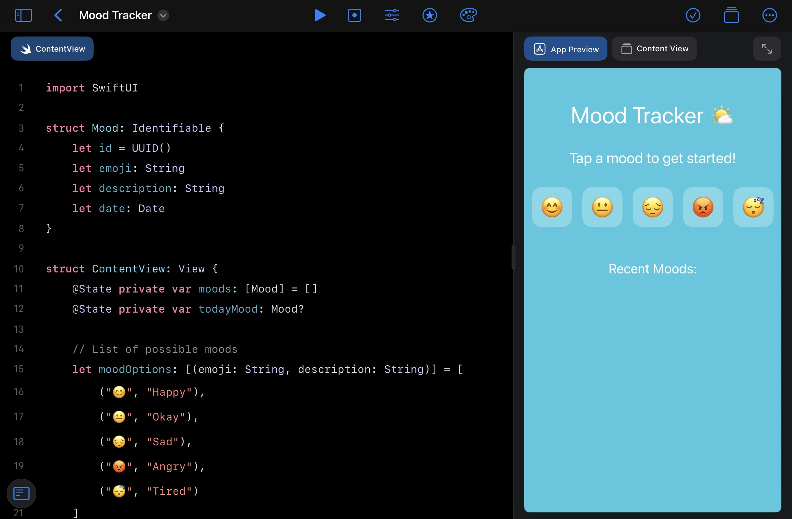
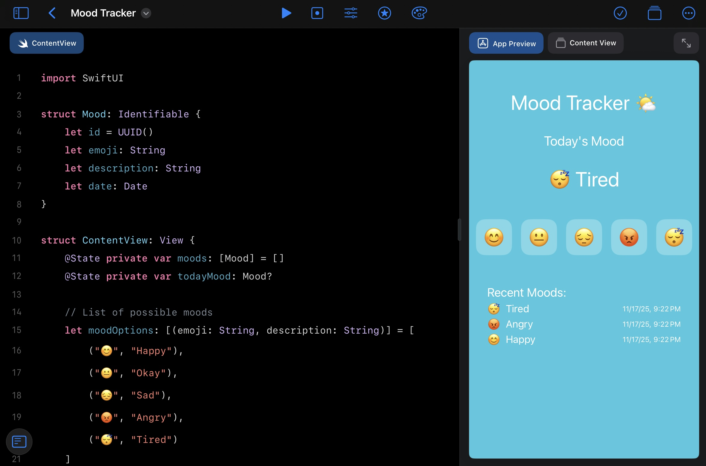
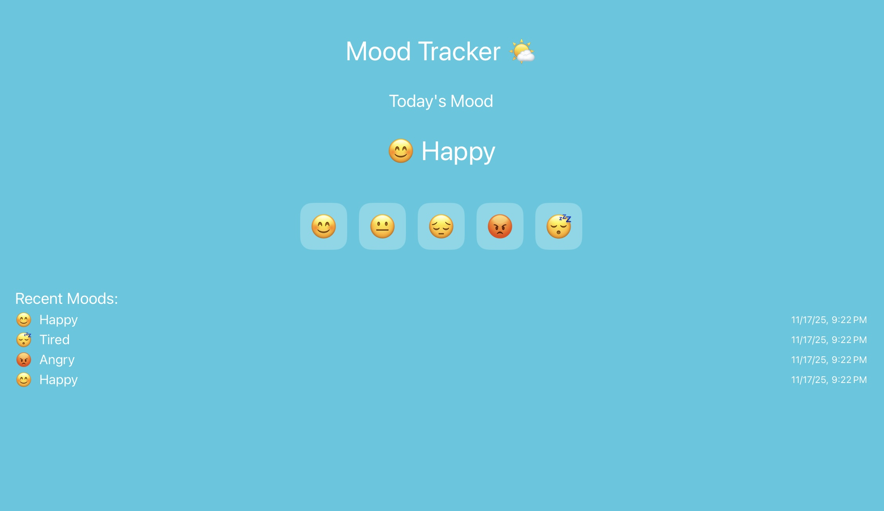

# Mood Tracker App

Mood Tracker App helps people with autism keep track of their feelings every day.  
You can log your mood, add notes, and see how your feelings change over time.  
It’s simple, calm, and easy to use.

---

## 📱 Screenshots

### Home Screen

### Log Mood

### Mood Chart

---

## ✨ Features
- **Daily Mood Logging**: Record how you feel each day.  
- **Notes & Details**: Add notes to remember why you felt a certain way.  
- **Mood Chart**: See your moods over time in easy-to-read charts.  
- **Reminders**: Get gentle reminders to log your mood every day.  
- **Simple Design**: Friendly and easy to use for everyone.

---

## 🛠️ How to Run
1. Open the project in **Xcode** or **Swift Playgrounds**.  
2. Build and run on a simulator or device.  
3. Log your mood, add notes, and watch your mood chart update.
